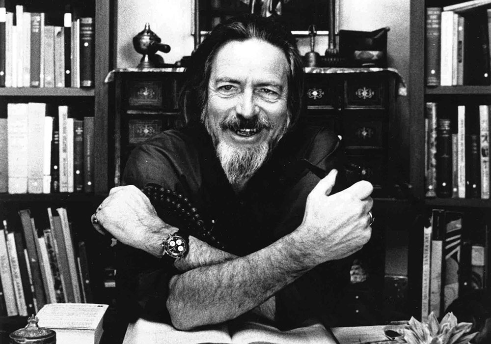

Si quieres saber más de la **pintura** de arriba <a href="/docs/arte/pinturas/" target="_blank">sigue este enlace</a>.

> "Tener fe es confiar en el agua. Cuando nadas no te agarras al agua, porque si lo haces te hundirás y te ahogarás. En lugar de eso, te relajas y flotas." -**Alan Watts**.

Hoy compartimos unos fragmentos en los que el profundo y divertido filósofo **Alan Watts** habla sobre lo que a su juicio es el verdadero significado de la palabra **fe**.

 *Fotografía de **Alan Watts** en blanco y negro.*

## Traducción

> Alan Watts sobre la fe:

"Fe es un estado de **apertura o confianza**.

Tener fe es como cuando te confías al agua. No te agarras al agua cuando nadas, porque si lo haces te quedarás rígido y tenso en el agua, y te hundirás. Tienes que relajarte, y **la actitud de fe es todo lo contrario de aferrarte y agarrarte**.

En otras palabras, una persona que es fanática en materia religiosa y se aferra a ciertas ideas sobre la naturaleza de Dios y el universo se convierte en una persona que no tiene ninguna fe. En lugar de eso, se mantiene rígida. Pero **la actitud de la fe es dejarse llevar y estar abierto a la verdad, cualquiera que resulte ser**."

> También, Alan Watts en La Sabiduria de la Inseguridad: Un mensaje para una edad de ansiedad, escribe sobre la diferencia entre creencia y fe:

Aquí debemos hacer una distinción clara entre **creencia y fe**, porque, en la práctica general, **creencia ha llegado a significar un estado mental que es casi lo opuesto a la f**e. Creencia, como uso la palabra aquí, es la insistencia en que la verdad es lo que uno "creería" o desearía que fuera. El creyente abrirá su mente a la verdad con la condición de que encaje con sus ideas y deseos preconcebidos. La fe, por otra parte, es una apertura sin reservas de la mente a la verdad, cualquiera que sea. **La fe no tiene ideas preconcebidas; es una inmersión en lo desconocido.** La creencia se aferra, pero la fe se suelta. En este sentido de la palabra, la fe es la virtud esencial de la ciencia, y de igual forma de cualquier religión que no sea el autoengaño.

[…]

La fase actual del pensamiento y la historia humanos... casi nos obliga a afrontar la realidad con la mente abierta, y sólo se puede conocer a Dios a través de una mente abierta, así como sólo se puede ver el cielo a través de una ventana despejada. **No verás el cielo si has cubierto el vidrio con pintura azul**.

Pero las personas "religiosas" que se resisten a raspar la pintura del vidrio, que consideran la actitud científica con miedo y desconfianza, y confunden la fe con aferrarse a ciertas ideas, curiosamente ignoran las leyes de la vida espiritual que podrían encontrar en sus propios registros tradicionales. Un cuidadoso estudio comparativo de la religión y la filosofía espiritual revela que el abandono de la creencia, de cualquier apego a una vida futura propia y de cualquier intento de escapar de la finitud y la mortalidad, es una etapa regular y normal en el camino del espíritu. De hecho, **este es en realidad un “primer principio” de la vida espiritual** que debería haber sido obvio desde el principio y, después de todo, parece sorprendente que los teólogos eruditos deberían **adoptar una actitud cooperativa hacia la filosofía crítica de la ciencia**."

## Fragmento original

> Alan Watts about faith:

"Faith is a state of openness or trust.

To have faith is like when you trust yourself to the water. You don’t grab hold of the water when you swim, because if you do you will become stiff and tight in the water, and sink. You have to relax, and the attitude of faith is the very opposite of clinging, and holding on.

In other words, a person who is fanatic in matters of religion, and clings to certain ideas about the nature of God and the universe becomes a person who has no faith at all. Instead they are holding tight. But the attitude of faith is to let go, and become open to truth, whatever it might turn out to be."

> Alan Watts in The Wisdom of Insecurity: A Message for an Age of Anxiety.

We must here make a clear distinction between belief and faith, because, in general practice, belief has come to mean a state of mind which is almost the opposite of faith. Belief, as I use the word here, is the insistence that the truth is what one would “lief” or wish it to be. The believer will open his mind to the truth on the condition that it fits in with his preconceived ideas and wishes. Faith, on the other hand, is an unreserved opening of the mind to the truth, whatever it may turn out to be. Faith has no preconceptions; it is a plunge into the unknown. Belief clings, but faith lets go. In this sense of the word, faith is the essential virtue of science, and likewise of any religion that is not self-deception.

[…]

The present phase of human thought and history... almost compels us to face reality with open minds, and you can only know God through an open mind just as you can only see the sky through a clear window. You will not see the sky if you have covered the glass with blue paint.

But "religious" people who resist the scraping of the paint from the glass, who regard the scientific attitude with fear and mistrust, and confuse faith with clinging to certain ideas, are curiously ignorant of laws of the spiritual life which they might find in their own traditional records. A careful study of comparative religion and spiritual philosophy reveals that abandonment of belief, of any clinging to a future life for one’s own, and of any attempt to escape from finitude and mortality, is a regular and normal stage in the way of the spirit. Indeed, this is actually such a “first principle” of the spiritual life that it should have been obvious from the beginning, and it seems, after all, surprising that learned theologians should adopt anything but a cooperative attitude towards the critical philosophy of science."

