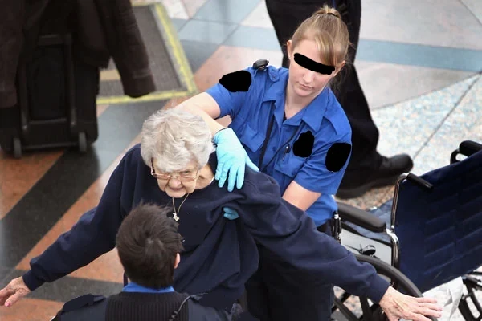
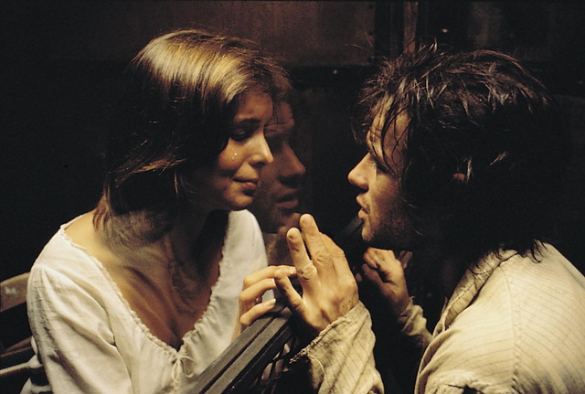

> "Todo listo para dirigirme al lugar (aeropuerto) en el cual el Estado y su poder político más <a href="/docs/espanol/palabras/#vejar" target="_blank">veja</a> a los individuos (la cantidad de papeles y controles crecen década a década)." -**Diego Giacomini**.

**Advertencia:** El siguiente artículo tiene como único objetivo incitar a la reflexión teniendo como punto de partida el derecho natural.

Alerta aeropuerto es probablemente **el programa más detestable y cobarde de la television**, una <a href="/docs/espanol/palabras/#alegoría-" target="_blank">alegoría</a> del control estatal que se disfraza de serie/documental, pero que **no es más que una burda propaganda** que busca normalizar la vejación de la propiedad individual (corporal y material), la obstaculización de la movilidad (el derecho humano a la libertad de movimiento) y la prohibición del intercambio pacifico (tanto cultural como de bienes).

> "Aeropuertos, donde la dignidad del ser humano es despreciada y sus derechos pisoteados como en pocos lugares. *Con la excusa de proteger nuestra seguridad* (**mentira**) los burócratas de carne y hueso nos pueden exigir casi todo lo que se les ocurra. **Nada tiene justificación ética**." -**Diego Giacomini**.

Y es que los burócratas que allí aparecen son exaltados cuál héroes, protectores de la salud pública y el interés común, que al ser un fin colectivo se <a href="/docs/espanol/palabras/#escabullir" target="_blank">escabulle</a> de cualquier intento por definirle, pero que por otro lado sirve para ocultar todo tipo de arbitrariedades que van desde solicitar papeles inútiles hasta la canallada de enviar a una persona a prisión durante décadas por cometer uno de los llamados **crímenes sin víctimas** (e incluso podríamos subrayar la crueldad en algunos casos indicando, como diría **Lysander Spooner**, que **los vicios no son delitos**).

> "**Toda pena** (dice el gran Montesquieu) que no se deriva de la **absoluta necesidad**, es **tiránica**." -**Cesare Beccaria**.

No sobra aclarar que algunas veces capturarán gente con verdaderas intenciones de hacer daño tangible al prójimo, pero visto el espectáculo serial, podríamos sospechar que en la mayoría de los casos no es así.

> "Si las tendencias **naturales de la humanidad son tan malas que no es seguro permitir que las personas sean libres**, ¿cómo es que las tendencias de estos organizadores son siempre buenas? ¿No pertenecen también a la raza humana los legisladores y sus agentes designados? **¿O creen ellos mismos que están hechos de una arcilla más fina que el resto de la humanidad?**". -**Frederic Bastiat**.

Para quienes les interesa la cruda realidad mas allá de la propaganda, una película como **El Expreso de Medianoche** que esta *inspirada* en una historia real, resulta una experiencia enriquecedora, y que a diferencia del apostolado estatal, no rehuye a las preguntas difíciles ni cae en la tentación de ofrecer una versión <a href="/docs/espanol/palabras/#maniqueísmo-" target="_blank">maniquea</a> de los hechos.

Una escena fuerte e inolvidable, cargada de dolor, odio y desesperanza, es el discurso del personaje de Billy Hayes ante el jurado corrupto que debido a ciertas presiones externas, le extenderá su sentencia:



> "**¿Qué es un crimen? ¿Qué es un castigo?** Parece que varían de momento a momento, de lugar a lugar. Lo que es legal hoy de pronto es ilegal mañana porque alguna sociedad dice que así es. Y lo que ayer era ilegal súbitamente es legal porque todo el mundo lo hace y no pueden meter a todo el mundo en la cárcel. **No estoy diciendo que sea correcto o no, sólo digo que así es.**

> (... ) Y usted, **quisiera que estuviera donde estoy yo ahora y sintiera lo que se siente**, porque conocería algo que no conoce señor fiscal: **¡Misericordia!**" -Extractos del discurso en **El Expreso de Medianoche**.

Los controles y la propaganda están condenados a crecer, pero también a fracasar. Lamentablemente, de momento seguirán destruyendo vidas y aplastando nuestras libertades.

> "(...)yo querría —eso lo he dicho muchas veces— un mínimo de Estado y **un máximo de individuo**. Pero, quizá sea preciso esperar... no sé si algunos decenios o algunos siglos —lo cual históricamente no es nada—, aunque yo, ciertamente no llegaré a ese mundo sin Estados. Para eso se necesitaría **una humanidad ética**, y además, **una humanidad intelectualmente más fuerte de lo que es ahora, de lo que somos nosotros**; ya que, sin duda, somos muy inmorales y muy poco inteligentes comparados con esos hombres del porvenir (...)." -**Jorge Luis Borges**.

