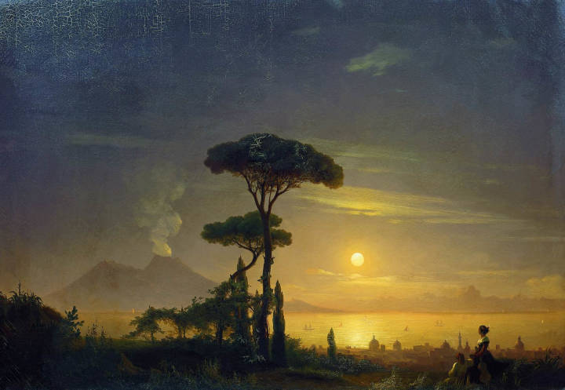

> "El pensamiento corrompe el lenguaje y **el lenguaje también puede corromper el pensamiento**" -George Orwell.

Consciente que una introducción provieniente de una mente <a href="/docs/espanol/palabras/#prosaico-" target="_blank">prosaica</a> como la mía no sería más que un obstáculo para avanzar en el asunto que nos atañe, me limitaré a dejar que las palabras del maestro Escohotado resuenen en el alma.


Duración **58 segundos**. Transcripción:

> "Tengo que llamar la atención hacia la verdadera dictadura que ahora estamos padeciendo, por ejemplo, en nombre de una academia de la lengua que pretende ser la propietaria de un asunto que no tiene propietario. Y que antes definía **curiosidad** *como interés por saber lo que las cosas son* y **desde el 94 define curiosidad** como interes por saber **indiscretamente** lo que las cosas son. Antes definia **asombro** como *origen del conocimiento filosófico*, y desde esa misma edición del 94, define asombro como *susto espanto*.

> **Ahí es donde está la mano del mediocre**, que intenta **recortarle a los demás la vida** y *decirles por donde tienen que ir*. Negarse a que la realidad es proceso e insistir en que la realidad es definición y dogma" -**Antonio Escohotado**.

## Cierre

> "**Uno no puede dejar de asombrarse** cuando contempla los misterios de la eternidad, de la vida, de la maravillosa estructura de la realidad. Es suficiente tratar de comprender un poquito de este misterio cada día; **nunca perder esa sagrada curiosidad**" -**Albert Einstein**.

Si quieres saber más de las **pinturas** que aparecen en este artículo <a href="/docs/arte/pinturas/" target="_blank">sigue este enlace</a>.
