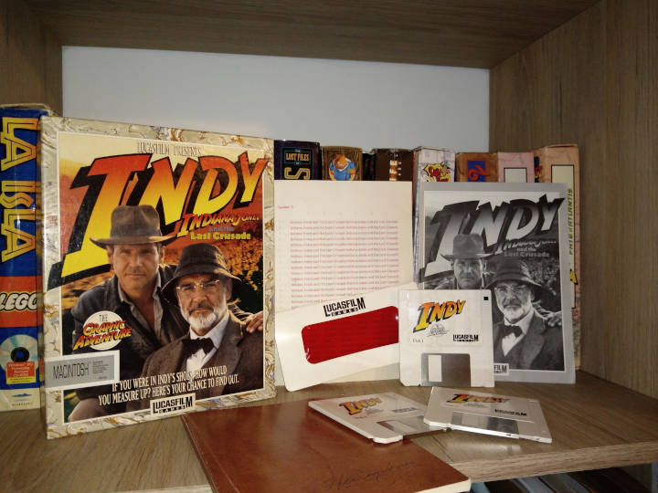
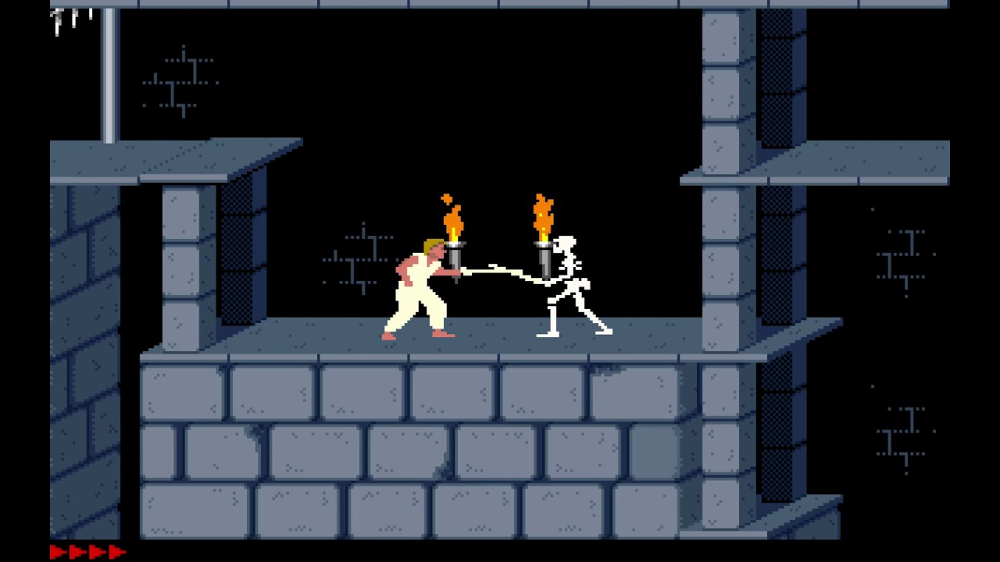
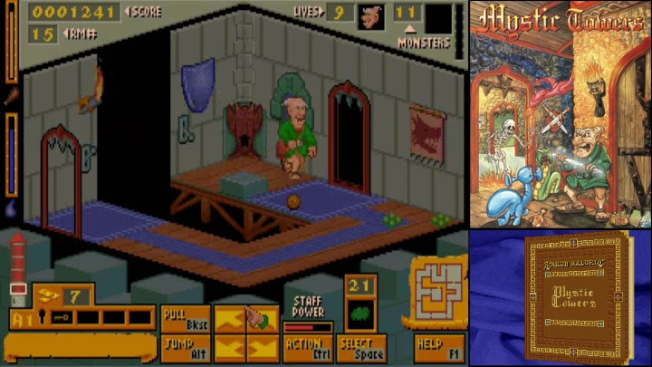
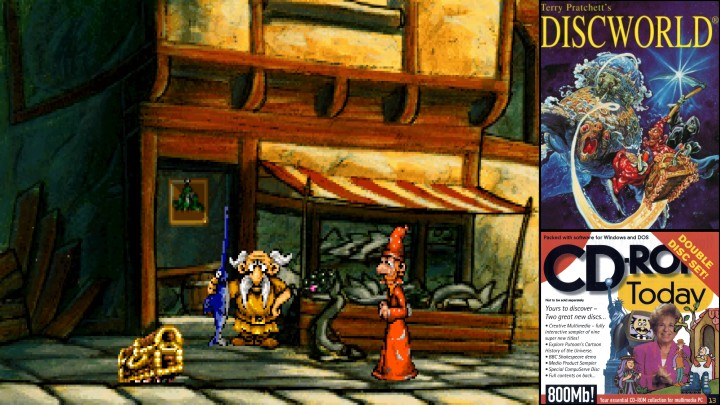
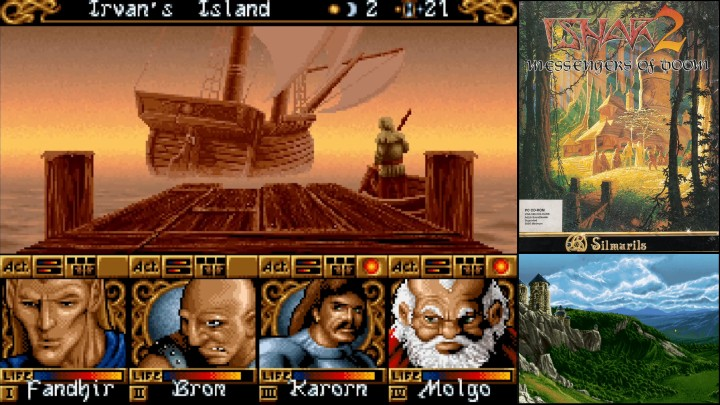

> "Sin dejarse llevar por el *torrentum* de productos, muchos de ellos de baja calidad, que invanden el mercado y que no hacen más que repetir los éxitos pasados, **las páginas de nuestra revista buscan**, ante todo y en lo posible, **lo novedoso**.\" 1995, Editorial de la PC-Player Número 5.

Hoy viajaremos en el pasado hasta el cada vez más lejano, 1991. Internet era apenas un lugar oscuro y sumamente lento en el primer mundo, y en suramérica ni siquiera sabíamos de su existencia. **Conseguir cualquier programa o juego era infinitamente más complicado**.

***Indiana Jones y La última cruzada**: La edición original traía varios cachivaches, incluído el diario de Henry Jones.*

Por su parte los originales, estaban fuera del alcance debido a sus precios exhorbitantes. Recuerdo estar muchas veces en los supermercados (de la ciudad más cercana al pueblo donde viviamos), con mi hermano mirando todas las cajas de juegos y soñando con algún día poder comprar aunque fuera uno de ellos.

La única opción real era que algún amigo, o un amigo de ese amigo, tuviera la gentileza de compartirte un disquete pirata (de dudosa procedencia) con algún que otro programa y, preferiblemente, un puñado de juegos. Las calidades variaban, de repente te tocaba un juego que se convertiría en un clásico de culto o quizá uno que sería olvidado a la vuelta de la esquina. **Pero la dificultad para conseguirlos, el aspecto físico propio del disquete todos sus entresijos y mecanismos, el compartir y el inherente riesgo a terminar con un virus o que el disco físico estuviese dañado, creaban un aura especial**.

***Prince of Persia**: Clásico entre clásicos. Conocido en nuestros países gracias a la piratería.*

Y para nosotros las cosas siguieron así, hasta una noche de 1996. Aún recuerdo con especial nitidez que recibimos de manos de nuestro padre una **extraña revista**. No es un regalo al que estuvieramos acostumbrados de niños. Sin embargo, esta revista era diferente a todas las demás, era una revista de juegos para PC, de hecho era la **PC-Player número 5**. Cargadas de discos con demos (usualmente uno o dos niveles de un juego), shareware (generalmente contenían el primer episodio de un juego) y a veces juegos completos, **pasaron a llenar nuestra infancia de momentos inolvidables***.

 ***Mystic Towers**: una experiencia oscura que nunca pudimos terminar, pero que siempre alimentó nuestra imaginación.*

Podíamos pasar horas jugando, leyendo e imaginando. En especial **imaginando** porque los juegos que no estaban completos, o que no estaban presentes en los discos (aquellos que sólo salían en los reportajes impresos de la revista), **permitián a la mente volar, fantaseando con explorar aquellos niveles llenos de colores y personajes pintorescos**.

La insistencia de mi padre a encontrar estas publicaciones (que eran escasas y sólo vendían en un par de sitios alejados) permitió que jugase junto con mi hermano, aunque fuera de forma parcial, a miles de títulos, que de otra forma hubiesen escapado de nuestro alcance. Pero también, que **pudiesemos tener nuestros primeros acercamientos con la curiosidad y el asombro, con la alegría del descubrir**: a veces nos sentábamos a explorar los recovecos más extraños de los discos, y en varias ocaciones fuimos recompenzados con juegos ocultos, que por error no aparecián en los índices de las revistas, ni en los menús de sus discos.

***Discworld** (Mundodisco): que lo encontró mi hermano en un disco curioso como ninguno. Digna coincidencia de la saga de Terry Pratchet.*

Esas revistas eran como **publicaciones cuasi-mágicas**, hechas por personas apasionadas que compartían sus experiencias y descubrimientos en ese mundillo incipiente del entretenimiento digital. Claro está, esas revistas desaparecieron con el tiempo, pero para quiénes tuvimos el placer de explorarlas, vivirán por siempre en nuestra memoria.

***Ishar 2**, uno de los viajes más difíciles pero gratificantes en aquel entonces.*

## Apéndice

Para quiénes les interese, aquí comparto la <a href="https://drive.google.com/file/d/1WxqeVjEd4L4I7DgMPaCelcsXQryijPSf/view?usp=share_link" target="_blank">PC-Player número 5</a> y algunos videos de las **demos** que contenia.

### Simon the Sorcerer 2
#### Demo


*  Por si te interesa, <a href="https://www.youtube.com/watch?v=_3PQnmcD_G8" target="_blank">Aquí el gameplay completo</a>.

### Braindead 13
#### Demo
El video se ve muy pequeño, pero la calidad de animación es excelente.


*  Por si te interesa, <a href="https://www.youtube.com/watch?v=F3dVe6hNcXk" target="_blank">aquí el gameplay completo</a>.

### Prisoner of Ice demo
#### Demo


*  Por si te interesa, <a href="https://www.youtube.com/watch?v=NPmZqqjvyB0" target="_blank">aquí el gameplay completo</a>.

### Ultimate Soccer Manager

