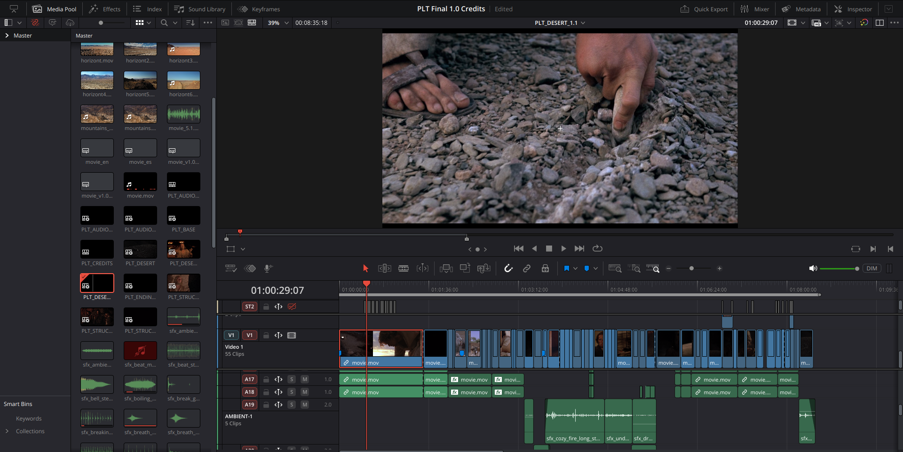

**The Last Temptation of Christ: JF Cut** propone una reedición completamente hecha a mano, curada y revisada de pies a cabeza de la película de Scorsese. El resultado es una experiencia más interior, más intensa y más singular de la figura del Mesías.

JFCut es una **edición de autor** que condensa casi tres horas en aproximadamente dos, y en ese ajuste gana fuerza, claridad y presencia.

<a href="https://jfcut.art/" class="btn btn-primary btn-lg" target="_blank" rel="noopener noreferrer">Visitar jfcut.art</a>

