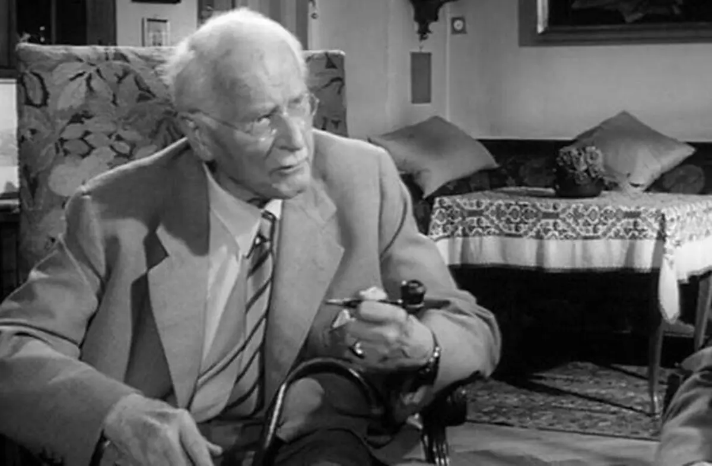

Si quieres saber más de las **pintura** de arriba <a href="/docs/arte/pinturas/" target="_blank">sigue este enlace</a>.

> "El espíritu de las **profundidades** tomó mi **entendimiento** y todo mi **conocimiento** y los puso al servicio de lo **inexplicable** y lo **paradójico**." -**Carl Jung**.

Mientras navegaba en internet me encontré en el más inusitado de los lugares -una red social- con un extraño y profundo fragmento del mítico **Libro Rojo de Carl Jung**, uno de las mentes más brillantes del siglo XX. A continuación la traducción de dicho fragmento (así como la versión original en inglés).

 *Fotografía de **Carl Jung** en blanco y negro.*

## Traducción

> Carl Gustav Jung, El Libro Rojo, Liber Primus, "Alma y Dios", Página 233.

"El espíritu de las profundidades incluso me enseñó a considerar mi acción y mi decisión como dependientes de los sueños. Los sueños allanan el camino de la vida, y te determinan aún sin que entiendas su lenguaje. A uno le gustaría aprender ese lenguaje, pero ¿quién puede enseñarlo y aprenderlo? La erudición por sí sola no es suficiente; **hay un conocimiento del corazón que da una visión más profunda**. El conocimiento del corazón no está en ningún libro y no se encuentra en la boca de ningún maestro, sino que brota de ti como la semilla verde de la tierra oscura. La erudición pertenece al espíritu de este tiempo, pero este espíritu de ninguna manera capta el sueño, ya que el alma está en todas partes donde el conocimiento erudito no está.

> Carl Gustav Jung, El Libro Rojo, Liber Primus, "El Camino de lo Que está por Venir", Páginas 229-230.

"Si hablo en el espíritu de este tiempo, debo decir: nadie ni nada puede justificar lo que debo anunciaros. La justificación me es superflua, ya que no tengo otra opción, pero debo hacerlo. He aprendido que además del espíritu de este tiempo **hay todavía otro espíritu en acción**, a saber, el que gobierna en el fondo de todo lo contemporáneo: el espíritu de este tiempo quisiera oír hablar de utilidad y valor. **Yo también pensaba así**, y mi humanidad todavía piensa así. Pero ese otro espíritu me obliga sin embargo a hablar, más allá de la justificación, la utilidad y el sentido.

Lleno de orgullo humano y cegado por el espíritu presuntuoso de la época, traté durante mucho tiempo de alejar de mí ese otro espíritu. Pero no consideré que el espíritu de las profundidades desde tiempo inmemorial y para todo el futuro posee un poder mayor que el espíritu de este tiempo, que cambia con las generaciones.

El espíritu de las profundidades ha subyugado todo orgullo y arrogancia al poder del juicio. Me quitó la creencia en la ciencia, me robó el gozo de explicar y ordenar las cosas, y dejó morir en mí la devoción a los ideales de esta época. Me obligó a bajar a las últimas y más simples cosas.

El espíritu de las profundidades tomó mi entendimiento y todos mis conocimientos y los puso al servicio de lo inexplicable y lo paradójico. Me robó la palabra y la escritura para todo lo que no estaba a su servicio, a saber, la fusión del sentido y el sinsentido, que produce el sentido supremo.

Pero el significado supremo es el camino, el camino y el puente hacia lo que está por venir. Ese es el Dios por venir. No es el mismo Dios que viene, sino su imagen la que aparece en el significado supremo. Dios es una imagen, y quienes lo adoran deben adorarlo en las imágenes del significado supremo.

El significado supremo no es un significado ni un absurdo, es imagen y fuerza en uno, magnificencia y fuerza juntas.

El significado supremo es el principio y el fin. Es el puente de la travesía y la realización.

Los otros Dioses murieron por su temporalidad, pero el significado supremo nunca muere, se convierte en significado y luego en absurdo, y del fuego y la sangre de su colisión surge el significado supremo rejuvenecido de nuevo.

La imagen de Dios tiene una sombra. El significado supremo es real y proyecta una sombra. Porque ¿qué puede ser actual y corpóreo y no tener sombra?

La sombra es el sinsentido. Carece de fuerza y ​​no tiene existencia continua a través de sí mismo. Pero el sinsentido es el hermano inseparable e imperecedero del significado supremo.

Como las plantas, así también los hombres crecen, unos en la luz, otros en las sombras. Hay muchos que necesitan las sombras y no la luz.

La imagen de Dios proyecta una sombra tan grande como ella misma.

El significado supremo es grande y pequeño, es tan ancho como el espacio del Cielo estrellado y tan estrecho como la célula del cuerpo vivo".

## Fragmento en inglés

> Carl Gustav Jung, The Red Book, Liber Primus, "Soul and God", Page 233

"The spirit of the depths even taught me to consider my action and my decision as dependent on dreams. Dreams pave the way for life, and they determine you without you understanding their language. One would like to learn this language, but who can teach and learn it? Scholarliness alone is not enough; there is a knowledge of the heart that gives deeper insight. The knowledge of the heart is in no book and is not to be found in the mouth of any teacher, but grows out of you like the green seed from the dark earth. Scholarliness belongs to the spirit of this time, but this spirit in no way grasps the dream, since the soul is everywhere that scholarly knowledge is not."

> Carl Gustav Jung, The Red Book, Liber Primus, "Soul and God", Page 233]

"If I speak in the spirit of this time I must say: no one and nothing can justify what I must proclaim to you. Justification is superfluous to me, since I have no choice, but I must. I have learned that in addition to the spirit of this time there is still another spirit at work, namely that which rules the depths of everything contemporary: The spirit of this time would like to hear of use and value. I also thought this way, and my humanity still thinks this way. But that other spirit forces me nevertheless to speak, beyond justification, use, and meaning.

Filled with human pride and blinded by the presumptuous spirit of the times, I long sought to hold that other spirit away from me. But I did not consider that the spirit of the depths from time immemorial and for all the future possesses a greater power than the spirit of this time, who changes with the generations.

The spirit of the depths has subjugated all pride and arrogance to the power of judgment. He took away my belief in science, he robbed me of the joy of explaining and ordering things, and he let devotion to the ideals of this time die out in me. He forced me down to the last and simplest things.

The spirit of the depths took my understanding and all my knowledge and placed them at the service of the inexplicable and the paradoxical. He robbed me of speech and writing for everything that was not in his service, namely the melting together of sense and nonsense, which produces the supreme meaning.

But the supreme meaning is the path, the way and the bridge to what is to come. That is the God yet to come. It is not the coming God himself, but his image which appears in the supreme meaning. God is an image, and those who worship him must worship him in the images of the supreme meaning.

The supreme meaning is not a meaning and not an absurdity, it is image and force in one, magnificence and force together.

The supreme meaning is the beginning and the end. It is the bridge of going across and fulfilment.

The other Gods died of their temporality, yet the supreme meaning never dies, it turns into meaning and then into absurdity, and out of the fire and blood of their collision the supreme meaning rises up rejuvenated anew.

The image of God has a shadow. The supreme meaning is real and casts a shadow. For what can be actual and corporeal and have no shadow?

The shadow is nonsense. It lacks force and has no continued existence through itself. But nonsense is the inseparable and undying brother of the supreme meaning.

Like plants, so men also grow, some in the light, others in the shadows. There are many who need the shadows and not the light.

The image of God throws a shadow that is just as great as itself.

The supreme meaning is great and small, it is as wide as the space of the starry Heaven and as narrow as the cell of the living body."

