Esta es una serie de recuerdos de tres juegos que dejaron marcas profundas en mi inconsciente, aunque sólo décadas después comienzo a entenderlas. Cada uno abre una puerta distinta:

1. **Commander Keen**: el niño.
2. **Another World**: el aislamiento. (próximamente)
3. **Prince of Persia**: el hombre. (próximamente)

Esta es una publicación multimedia —texto, imagenes y sonido—. Como música de fondo, esta es la recomendación, dale clic para que suene:

<iframe width="120" height="120" src="https://www.youtube-nocookie.com/embed/hvzQQOAjuoU?si=T61m0ELf3558cyng" title="YouTube video player" frameborder="0" allow="accelerometer; autoplay; clipboard-write; encrypted-media; gyroscope; picture-in-picture; web-share" referrerpolicy="strict-origin-when-cross-origin" allowfullscreen></iframe>

Una vez esté sonando la música, utiliza estos botones para navegar entre las "páginas" del artículo.

<a href="#estudio" class="btn btn-primary btn-lg">EMPEZAR <i class="bi bi-rocket-takeoff-fill"></i></a>

&nbsp;

 
 

## Commander Keen y el niño

> "**El niño** simboliza el aspecto preconsciente de la totalidad del hombre." - **Jung**.

1992, en el piso 6 de un edificio entre las montañas de Venezuela, hay un pequeño estudio, de esos espacios que cuando nos extingamos bien podrían decir: *«así lucía un verdadero templo humano, ahí era donde ellos creaban»*.

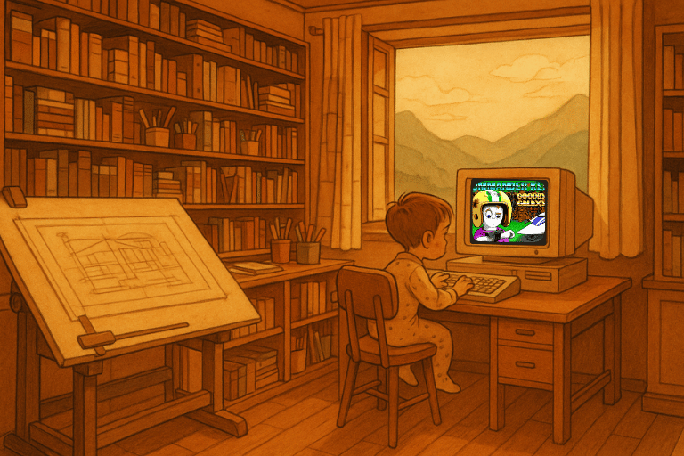

El ambiente es cálido y acogedor, de un tono amarillento, mezclado con madera, mucha madera. Todo está ordenado en repisas de múltiples niveles, en las que reposan manuales, disquettes, libros de arquitectura y pocillos llenos de lápices y marcadores. Al entrar, se ve una mesa de dibujo, propia de un arquitecto; a la derecha, junto a una ventana, está un computador —exhibido sobre una mesa de madera—. Es de un plástico muy sólido, de ese que ya no estamos acostumbrados a ver en 2025. En él juega un niño en pijama. Sus dedos son pequeños y debe juntar varios de ellos a la vez para presionar las teclas, acomodadas en aquel teclado mecánico que responde a cada acción con un seco y contundente *clac*.

<a href="#parte-1" class="btn btn-primary btn-lg">AVANZAR  <i class="bi bi-arrow-return-left"></i></a>

&nbsp;

 
 

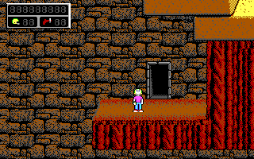

Los pies del niño cuelgan de una silla y sólo se percibe cómo tensa sus músculos, como haciendo fuerza para que el personaje que controla pueda saltar el siguiente obstáculo. En la pantalla, escasos pero coloridos 16 tonos, retratan un mundo extraterrestre de fantasía. Puede ver el final del nivel, allá arriba en la esquina. Corre hasta el borde y presiona **CONTROL** para saltar. Demasiado tarde. **Game Over**.

<a href="#parte-2" class="btn btn-primary btn-lg">AVANZAR  <i class="bi bi-arrow-return-left"></i></a>

&nbsp;

 
 

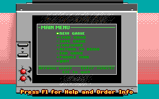

Horas de juego le han enseñado que no existen caminos fáciles. Y que los mejores niveles están llenos de secretos: algunos ocultos tras pasadizos invisibles, otros aparentemente inalcanzables en el horizonte —*sólo aparentemente*. Presiona **AVANZAR**. Comienza una nueva partida.

<a href="#parte-3" class="btn btn-primary btn-lg">AVANZAR  <i class="bi bi-arrow-return-left"></i></a>

&nbsp;

 
 

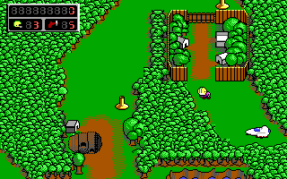

Ve desde arriba un personaje de computador de piel completamente blanca y unos pequeños ojos cuadrados. Casco amarillo, camisa morada, pantalones azules y tenis rojos. Es diminuto, pero su postura erguida lo dice todo. Camina desde su nave hasta la primera villa. La puerta está cerrada y debe superar el nivel para avanzar en el mapa. Presiona **AVANZAR** y la máquina responde entonando una fanfarria.

<a href="#parte-4" class="btn btn-primary btn-lg">AVANZAR  <i class="bi bi-arrow-return-left"></i></a>

&nbsp;

 
 

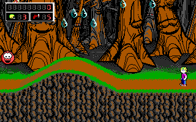

Ahora el niño puede explorar. Una nueva perspectiva brota de los pixeles y el mundo se abre ante él. El nivel se extiende hacia los costados y no apremia. Hay árboles que se mueven como si estuvieran vivos. Casas de piedra dispersas en el bosque. Desde algunas se puede bajar a cavernas, llenas de caramelos y munición para la pistola.

<a href="#parte-5" class="btn btn-primary btn-lg">AVANZAR  <i class="bi bi-arrow-return-left"></i></a>

&nbsp;

 
 

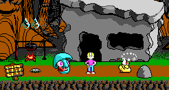

Sin embargo, al niño se le antoja fácil el nivel. **Ya lo conoce** y sabe qué hacer. Pronto lo termina y regresa al mapa. Se abre un mundo de posibilidades. Sitios únicos, símbolos, llaves, princesas, sabios y demonios. Demasiadas cosas para entenderlas, suficientes para querer seguir jugando.

<a href="#parte-6" class="btn btn-primary btn-lg">AVANZAR  <i class="bi bi-arrow-return-left"></i></a>

&nbsp;

 
 

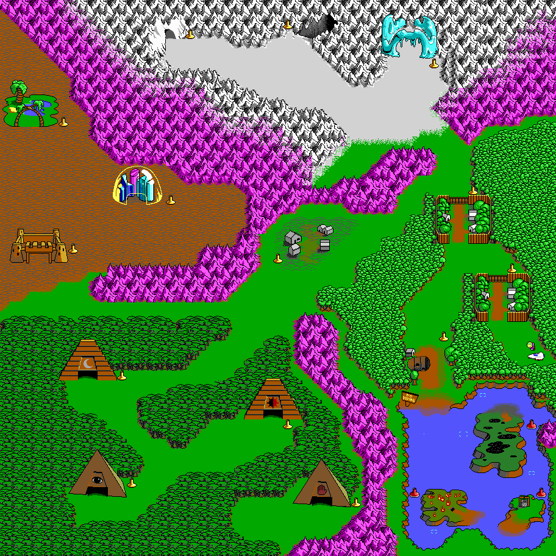

 

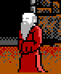
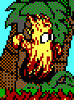
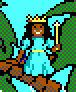

 

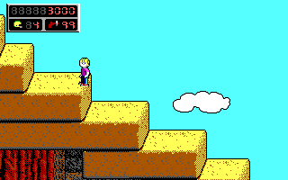
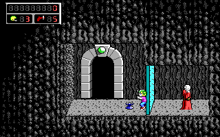
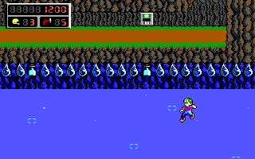
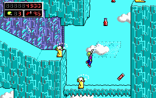

<a href="#parte-7" class="btn btn-primary btn-lg">AVANZAR  <i class="bi bi-arrow-return-left"></i></a>

&nbsp;

 
 
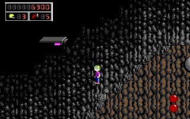

— Dani, a dormir —dice Mamá a lo lejos.

— Un cuarto de hora más... ¿Si? —responde por reflejo, como ha aprendido a hacerlo al escuchar a los adultos. Para él significa cuarenta minutos más, y el llamado de mamá a los escasos quince minutos siguientes, se siente como un pequeño engaño.

<a href="#fin" class="btn btn-primary btn-lg">AVANZAR  <i class="bi bi-arrow-return-left"></i></a>

&nbsp;

 
 

Presiona **ESCAPE**. Guarda la partida. Sale del juego. Hunde el botón con forma de **switch**. La electricidad deja de fluir hacia la máquina, que se despide con un último destello de luz mientras la pantalla libera sus últimos electrones contra el cristal.

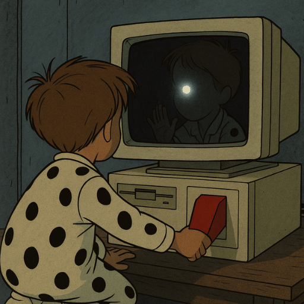

<!--
## Another World

> "El arte es una especie de instinto que empuja al hombre a expresar su naturaleza interna." - **Jung**.

another.exe

Enemigos alienigenas.

Caer por azar.

## Prince of Persia

> "El verdadero camino del héroe es el retorno hacia sí mismo." -**Jung**.

La injusticia.

Enemigos humanos.
-->

