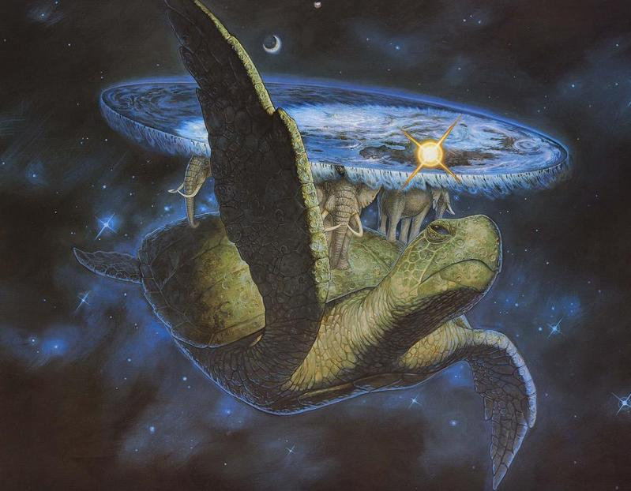

> "A William de Worde, editor accidental del primer periódico del **Mundodisco**, siempre le ha preocupado la **naturaleza de la verdad**. Sabe que se **esconde en lugares improbables y cuenta con sirvientes extraños**." *La Verdad, XXV novela del Mundodisco*.

Uno pensaría encontrar **sabiduría** en elegantes manuscritos ancestrales, no en una novela escrita en **clave de humor**, mucho menos una en la que el *mundo es plano y está sostenido por elefantes que viajan encima de una tortuga gigante a través del espacio*. Sin embargo, quién decida entrar en las páginas inmortales del **Mundodisco** y salga de allí sin cambiar de opinión, sólo podría catalogarse como un necio irreparable.

**Mundodisco** es una saga de novelas creada por **Terry Pratchet**,  una obra única en su estilo que combina de forma excelsa lo cómico y lo filosófico, lo mágico y científico, lo mundano y lo transcendental del ser humano. Un continuo conflicto que suele difuminar la linea entre la burla y la crítica, retratando entre líneas la dualidad de la naturaleza humana: una frágil existencia empujada por ambiciones desmedidas (usualmente ridículas para un ser tan fútil).

Dicho esto, mientras leía el libro **La Verdad**, la XXV novela del **Mundodisco**, me topé con algunas inusitadas lecciones de sabiduría que me he sentido obligado a compartir con ustedes. Éste es el fragmento:

> Se dice que hay dos tipos de personas en el mundo. Están aquellos que, cuando se les presenta un vaso que está exactamente medio lleno, dicen: este vaso está medio lleno. Y están aquellos que dicen: este vaso está medio vacío.

> El mundo pertenece, sin embargo, a aquellos que pueden mirar el vaso y decir: «¿Qué le pasa a este vaso? ¿Perdone? ¡Perdone! ¿Este es mi vaso? Me parece a mí que no. ¡Mi vaso estaba lleno! ¡Y era un vaso más grande!» .

> Y en el otro extremo de la barra, el mundo está lleno del otro tipo de personas, las que tienen el vaso roto, o un vaso derribado por descuido (habitualmente por una de las personas que piden un vaso más grande), o las que ni siquiera tienen vaso, porque estaban al fondo de la muchedumbre y no han conseguido llamar la atención del barman.
