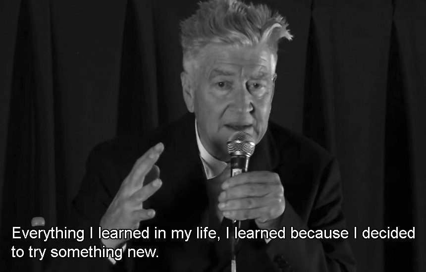
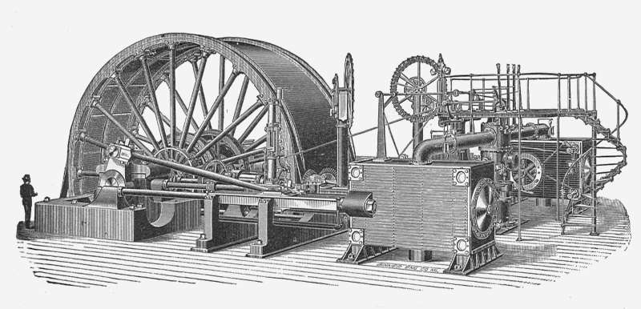

**Guiar** y **arruinar** son dos palabras que de antemano no parecerían tener nada en común, sin embargo, en algún momento todos experimentaremos la delgada línea que las puede llegar a separar: **la intención**. Un consejo o una mera crítica por lo general están inclinados (conscientemente o no) en alguno de estos dos sentidos.

* **Guiar** (guide): mostrar a las personas el camino a un lugar en una región difícil o peligrosa.
* **Arruinar** (spoil): prevenir que also sea exitoso o satisfactorio.

Luego, hay consejos cuya intención es **guiar** y otros que sólo aspiran a **arruinar**, a descarrilar el vagón del esfuerzo. Por ejemplo, un "*no hagas eso así*" podría encaminar y ahorrar mucho tiempo o quizá simplemente sea una afirmación cargada de envidia y pretenda frustrar cualquier intento de progreso. **Una delgada línea** que crea una basta diferencia.

En este orden de ideas, quisiera llamar la atención sobre uno de los consejos más perniciosos que he oído y que usualmente pretende disfrazarse de bien intencionado. Lo habrán oído aquellos dedicados a esfuerzos **creativos e intelectuales** (especialmente **programación de ordenadores**), y no es otro que la falacia de que **ya todo está inventado**, que no hay nada nuevo por hacer, el famoso **"no reinventes la rueda"**. Quién dice esto, en el mejor de los casos, no sabe de lo que habla y es un ingenuo.

> "Todo lo que **aprendí** en mi **vida**, lo aprendí porque decidí probar algo **nuevo**" -**David Lynch**.

El siguiente fragmento extraído de un video de **Casey Muratori**, famoso entre otras cosas por su serie <a href="https://handmadehero.org/" target="_blank" rel="noopener noreferrer">Handmade Hero</a> (donde enseña como programar un videojuego y su motor desde cero) servirá como ilustración para entender el problema.

## De la rueda y los programas de computador

> "Decir **reinventar la rueda** es una declaración muy engañosa y siempre me preocupa un poco cuando la gente dice cosas como **¿Por qué reinventar la rueda?** Y la razón es porque la rueda es una invención increíble, es casi perfecta, o inclusive, es posiblemente perfecta para lo que hace.

> Cuando miras **una rueda es el tipo de cosa que perfectamente convierte fricción dinámica en fricción estática** para mover objetos. Es algo que es tan **elegante y hermoso** que si me preguntan ¿por qué querrías reinventarla? por supuesto diría que no quieres reinventar la rueda. La rueda es increíble: ha funcionado por miles de años; no ha sido alterada por miles de años. **El concepto, probablemente, es el mismo hoy que la primera vez que se hizo una rueda, hace físicamente lo mismo.**

> **Nada de lo que hemos desarrollado** en los últimos 30 años de desarrollo de videojuegos es una rueda. **No tenemos una sóla rueda.** Si piensas que Unity o Unreal son ruedas, es simple y llanamente una visión corta, simplista. Lo siento, pero esa es la verdad." -**Casey Muratori**.


***Video completo**: Por qué empece desde 0 en vez de usar un motor de juegos.*

> "Creemos que entendemos **las reglas** cuando nos volvemos **adultos**, pero lo que realmente experimentamos es la **reducción de la imaginación**." -**David Lynch**.

## Cierre

Considero que no sobra aclarar que esta no es una llamada a una especie de <a href="/docs/espanol/palabras/#autarquía-" target="_blank">autarquía</a>; más bien esta es una defensa del pensamiento crítico, quizá una invitación a explorar los confines más recónditos de lo que sea que apasione al lector, a no dar las cosas por sentado, a reemplazar el dogma por conocimiento.

> "El mundo no es lo que lo que nos dicen que es, sino lo que vemos con nuestros propios ojos". -**Antonio Escohotado**.

Si quieres saber más de las **pinturas** que aparecen en este artículo <a href="/docs/arte/pinturas/" target="_blank">sigue este enlace</a>.
