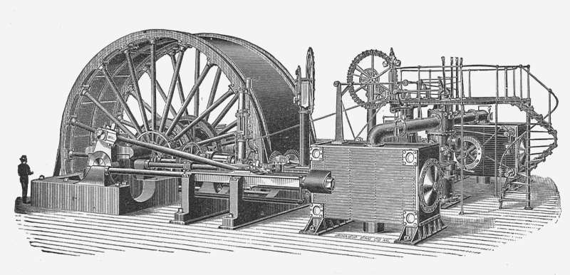

Si quieres saber más sobre a pintura <a href="/docs/compilaciones/pinturas/" target="_blank">sigue este enlace</a>.

> "Creemos que entendemos **las reglas** cuando nos volvemos **adultos**, pero lo que realmente experimentamos es la **reducción de la imaginación**." -**David Lynch**.

**Guiar** y **arruinar** son dos palabras que de antemano no parecerían tener nada en común, sin embargo, en algún momento todos experimentaremos la delgada línea que las puede llegar a separar: **la intención**. Un consejo o una crítica por lo general están inclinados hacia alguna de estas orillas:

* **Guiar** (guide): mostrar a las personas el camino a un lugar en una región difícil o peligrosa.
* **Arruinar** (spoil): prevenir que also sea exitoso o satisfactorio.

Hay consejos cuya intención es **guiar** y otros que sólo aspiran a **arruinar**, a descarrilar el vagón del esfuerzo. Por ejemplo, un "*no hagas eso así*" podría encaminar y ahorrar mucho tiempo, o quizá simplemente sea una afirmación cargada de envidia que pretende frustrar cualquier intento de progreso. **Una delgada línea** creando una basta diferencia.

En este orden de ideas, quisiera llamar la atención sobre uno de los consejos más perniciosos que he oído y que usualmente pretende disfrazarse de bien intencionado. Lo habrán oído aquellos dedicados a esfuerzos **creativos e intelectuales** (especialmente **programación de ordenadores**), la falaz afirmación "**ya todo está inventado**", pretender que no hay nada nuevo por hacer, consentir el estancamiento con la excusa de **no reinventar la rueda**. Quién dice esto, en el mejor de los casos, no sabe de lo que habla y es un ingenuo.

El **no reinventes la rueda**, da por hecho que lo que tiene enfrente es una rueda. Asume que ya existe una solución perfecta, universal, cerrada; que explorar de primera mano es un desperdicio.

Pero esto rara vez es cierto. Y aquí es donde un ejemplo concreto puede ayudar a iluminar el error.

## De la rueda y los programas de computador

El siguiente fragmento de **Casey Muratori**, famoso entre otras cosas por su serie <a href="https://handmadehero.org/" target="_blank" rel="noopener noreferrer">Handmade Hero</a>, no es el argumento central del artículo, sino una lámpara que ilumina lo que hay detrás de *no reinventar la rueda*.

> "Decir **reinventar la rueda** es una declaración muy engañosa y siempre me preocupa un poco cuando la gente dice cosas como **¿Por qué reinventar la rueda?** Y la razón es porque la rueda es una invención increíble, es casi perfecta, o inclusive, es posiblemente perfecta para lo que hace.

> Cuando miras **una rueda es el tipo de cosa que perfectamente convierte fricción dinámica en fricción estática** para mover objetos. Es algo que es tan **elegante y hermoso** que si me preguntan ¿por qué querrías reinventarla? por supuesto diría que no quieres reinventar la rueda. La rueda es increíble: ha funcionado por miles de años; no ha sido alterada por miles de años. **El concepto, probablemente, es el mismo hoy que la primera vez que se hizo una rueda, hace físicamente lo mismo.**

> **Nada de lo que hemos desarrollado** en los últimos 30 años de desarrollo de videojuegos es una rueda. **No tenemos una sóla rueda.** Si piensas que Unity o Unreal son ruedas, es simple y llanamente una visión corta, simplista. Lo siento, pero esa es la verdad." -**Casey Muratori**.


***Video completo**: Por qué empecé desde cero en vez de usar un motor de juegos.*

## ¿Y ahora qué?

Conviene aclarar que esta no es una invitación a la <a href="/docs/espanol/palabras/#autarquía-" target="_blank">autarquía</a> ni a reinventarlo todo por capricho. Es, más bien, una llamada a explorar los confines de aquello que nos apasiona, a no dar las cosas por sentado, **a sustituir el dogma por conocimiento vivido**.

Recordar siempre que lo nuevo no se descubre obedeciendo las recetas del pasado, sino abriendo la mente, el cuerpo y el espíritu a la majestuosa vastedad de un universo infinito.
