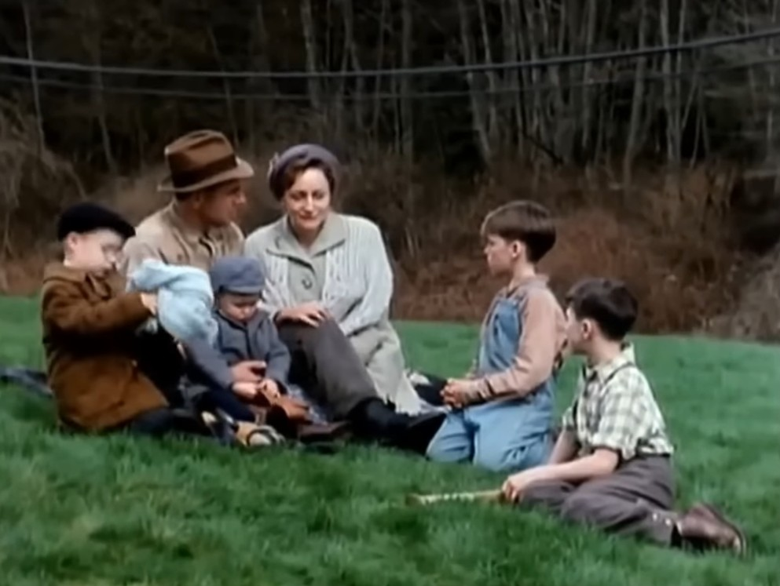

> "Ustedes lo encierran lo llenan de medicinas agujas y quien sabe que más lo maltratan y no hay discusión. **Soy su padre**. **Tan solo quiero verlo decirle hola**... y eso no." *Elmer Jackson*, pidiendo ver a su hijo.

**El Valor de una Promesa** (*After the Promise*, en inglés) es una película basada en hechos reales que retrata con crudeza como un hombre y sus **cuatro hijos pequeños** son destruídos moral y físicamente, por parte de un **sistema** capaz de las **más horribles vejaciones a la naturaleza humana**.

Durante 130 minutos seremos testigos de la **persecución violenta** que lideran **burócratas del Estado** en un intento por acabar con lo que queda de la familia Jackson, luego de que la madre muriese a causa de sus creencias religiosas que le impiden visitar al médico.

Algunos impulsados por la sevicia, otros escudados en la ley, **trabajadores sociales, médicos, jueces y polícias** pasan a convertirse en **engranajes de una maquinaria inhumana** capaz de separar, corromper, traumatizar y esterilizar a niños, de forma impune y en nombre de un supuesto bien común, que cómo no podría ser de otra forma, resulta ser el *más retorcido capricho* de aquellos al **servicio del poder político**.

 *"Tu padre es tan solo un sujeto que vive de un martillo y clavos."*

La historia de Elmer Jackson, un humilde carpintero y sus hijos, es un conmovedor relato que estoy seguro no dejará a nadie indiferente, y que analizado desde la óptica de la lucha del ser humano por su libertad, en el más amplio de sus significados, **es una película que retrata el verdadero talante del Estado: su naturaleza siempre violenta**.

## Película completa

Aquí está la cinta completa. La grabación tiene un audio de calidad regular, lamentablemente, pero no por ello se hace menos disfrutable la experiencia.



## Algunas reflexiones adicionales

Antes de terminar, quisiera compartir un fragmento de una de las conversaciones de la película, en la que un Doctor discute sobre su obligación moral con el paciente, así como una frase de **Gustave de Molinari** a modo de conclusión de este breve artículo.

> - Tenemos una obligación moral hacia la comunidad en estos casos. Yo estoy seguro que estás de acuerdo conmigo...
> - No, no lo estoy. Y cuando se refiere el Doctor Prentice, creo que **primero pienso en mi obligación moral hacia el paciente** y no en la comunidad.
> - No vamos a discutir sobre moral ahora. El Doctor Prentice sólo actúa de acuerdo a las políticas del Estado en estos asuntos. (...)  Richard Jackson se quedará aquí será **esterilizado** cuando llegue a la edad especificada aquí.

> La ausencia de Estado "(...) no es garantia de que algunas personas no matarán, lastimarán, secuestrarán, defraudarán, o robarán de otros. **El gobierno es la garantía de que algunos lo harán**" -Gustave de Molinari.

