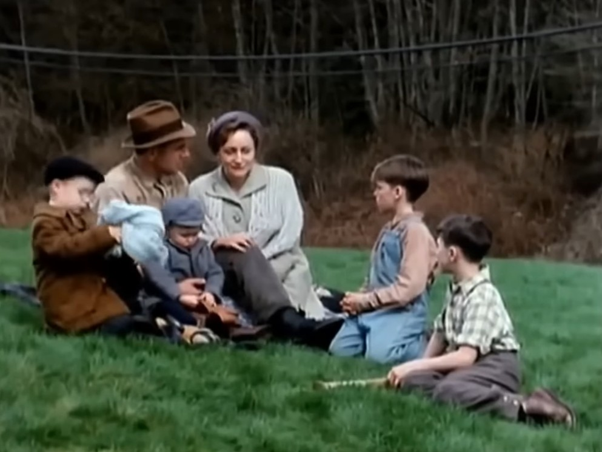
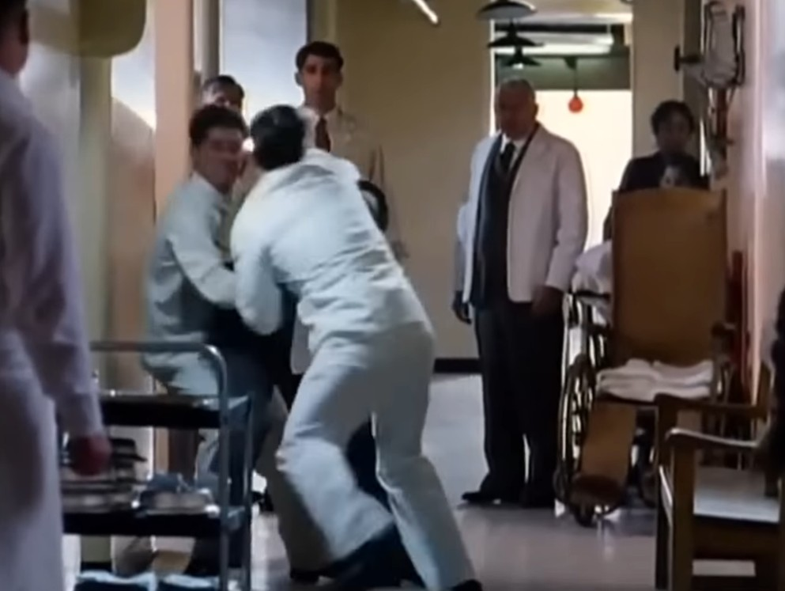

> Texto creado en colaboración entre humano y máquina.

**El Valor de una Promesa** (After the Promise, en inglés) es una película basada en hechos reales que cuenta la historia de un padre, Elmer Jackson, que intenta mantener unidos a sus cuatro hijos tras la muerte de su esposa.

Elmer Jackson descubre que la **maquinaria estatal** -incluyendo trabajadores sociales, médicos, jueces y policías- puede arrebatarle todo con una determinación fría y carente de cualquier atisbo de humanidad. Las decisiones se justifican en protocolos; **las consecuencias las sufren los niños**.

La danza macabra no necesita villanos, basta con **personas obedientes**, convencidas de que hacen lo correcto. Así, paso a paso, *los niños son traumatizados, separados y hasta esterilizados*.

> - *Doctor Prentice:* Tenemos una obligación moral hacia la comunidad en estos casos. Yo estoy seguro que estás de acuerdo conmigo...
> - *Doctor Richard:* No, no lo estoy. **Primero pienso en mi obligación moral hacia el paciente** y no en la comunidad.
> - *Doctor Prentice:* No vamos a discutir sobre moral ahora. Yo sólo actúo de acuerdo a las políticas del Estado en estos asuntos. Richard Jackson se quedará aquí será **esterilizado** cuando llegue a la edad especificada aquí.

Este es un testimonio de los peligros reales que encarna **El Leviatán**. Y ahí está lo más inquietante:

> Que la tragedia no surge del mal, sino de la sumisión; **no del odio, sino de la obediencia**.

## Película completa

Aquí está la cinta completa. La grabación tiene un audio de calidad regular, lamentablemente.


